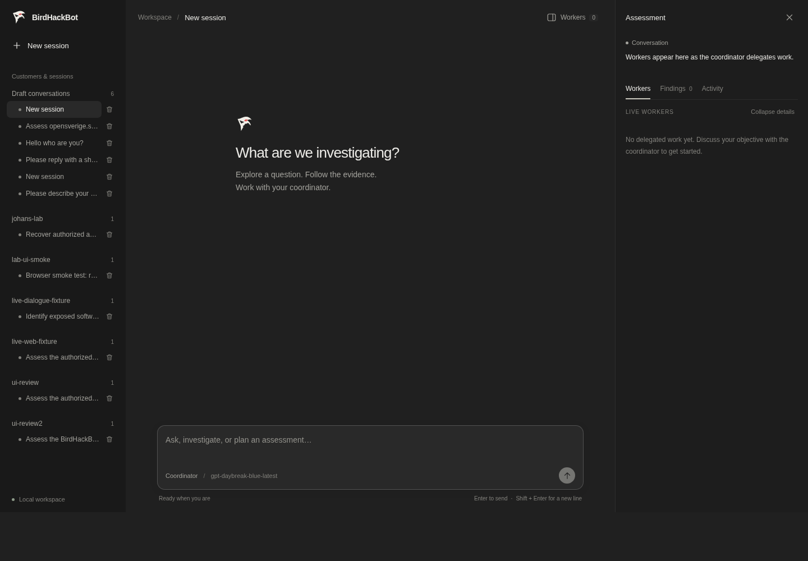
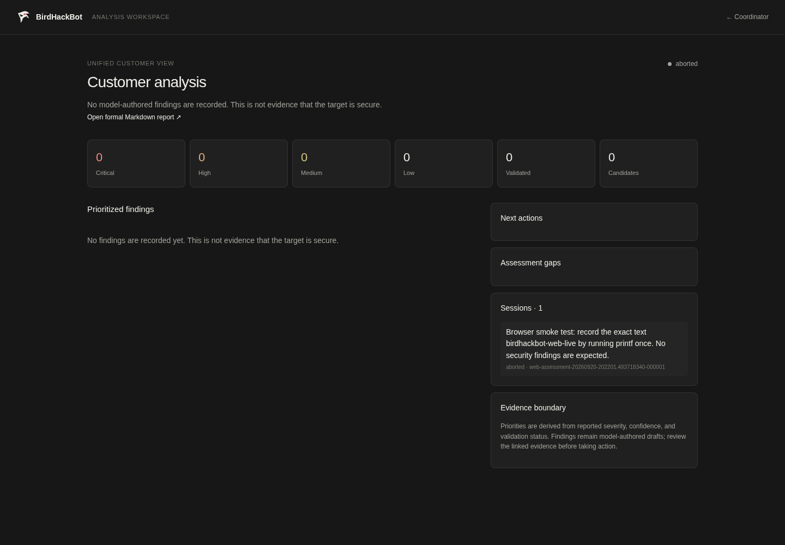

# BirdHackBot / CodeHackBot

BirdHackBot is System Verification's security testing platform for authorized assessments. Its supported deployment platform is Kali Linux Rolling, where the model-led multi-agent orchestrator coordinates investigation, source analysis, target validation, and reproducible reporting.

<p align="center">
  
</p>

The full raven wordmark is used for larger presentation; the web console switches to a compact raven-head mark at favicon and small-header sizes so the eye and silhouette remain legible.

The product is organized around a conversation with a coordinator. Explain the situation in plain language, review preliminary focused/balanced/thorough investigation choices and time ranges, then let the coordinator build and adapt a test sequence. Choose which bounded tasks may run and follow parallel workers as they collect evidence. After each round, the coordinator briefly explains what the evidence established and what it proposes to do next. Chat is the control surface; analysis and reporting are separate review surfaces.

## Screenshots

These captures show the two primary operator surfaces from the loopback web application: the live coordinator console and the customer-level analysis workspace. Both are real application views from a controlled lab workflow.





## What works today

The core agentic workflow is operational. The coordinator receives a plain-language objective, reasons over the declared scope and observed evidence, proposes bounded tests, and adapts the next round from worker results. One shared adaptive worker loop powers both standalone and delegated tasks; each delegated task gets its own worker run, workspace, context packet, approvals, evidence, and session snapshot. The coordinator can run up to two independent worker runs concurrently and schedule dependent validation in a later round. The [worker audit](docs/worker-foundation-audit-2026-09-20.md) records the rebuild evidence and remaining acceptance limits.

The coordinator and workers receive a compact [local strategy catalog](docs/strategies/catalog.md) covering discovery, services, source, web/API, identity, configuration, recovery, validation, and reporting. The coordinator can propose a visible research round when knowledge is missing and suggest up to two relevant guides for each worker task. The worker decides whether to load a guide and may change its choice as evidence develops; only selected guides enter that worker's durable context with source and checksum. These guides frame decisions, while [runbooks](docs/runbooks/) offer more procedural help; neither replaces target-side evidence. The [archive baseline](docs/experiments/codex-archive-baseline-2026-09-23.md) shows why this matters: a standard Kali John rule recovered a local archive quickly after an earlier search omitted common mutations.

A local authenticated REST bridge provides subscription-backed OpenAI inference, including bounded screenshot/PDF input for the model-led coordinator and workers. Launching without flags opens an interactive guided assessment with a coordinator, up to two concurrent workers, serialized action approvals, saved evidence, resumable assessment state, and a formal report draft. Kali tooling, adaptive task planning, CVE/advisory research, task-local helper construction, evidence capture, and dependent validation are part of the operating model. Source-to-deployment correlation and independent finding verification remain planned. The runtime does not enforce target allowlists or provide its own network sandbox; the operator is responsible for authorization, target boundaries, and the execution environment, as described in [AGENTS.md](AGENTS.md).

The initial browser surface is available through `birdhackbot-web`. It is chat-first and multimodal: the shared intake protocol lets the coordinator explain the harness, resolve exploratory discovery with bounded read-only observations (including fixed host identity metadata), clarify the requested target and work when genuinely ambiguous, and propose an assessment before the operator sees a compact review card. The operator owns authorization; the app does not demand proof, an RoE form, or a fixed checklist before a run. Formal customer reports can record authorization and RoE details supplied by the operator. The conversation and proposal are saved with the session. After starting, the coordinator proposes a bounded test sequence in the main conversation; the operator can select or reject tasks before workers execute. Workers remain visible while the operator continues talking to the coordinator. The chat shows short conclusions and compact activity summaries, with technical plans, commands, and evidence available in expandable detail and the report. The browser uses the same coordinator and worker runtime as the terminal UI, keeps scope and approval levels visible, groups multiple assessment sessions under a customer workspace, and lets you drag an unclassified draft conversation into an existing customer workspace before starting it.

The composer accepts bounded screenshots and PDFs. Images are sent as typed multimodal input; the subscription bridge forwards images and PDFs to the Responses model path, while local endpoints must advertise their own multimodal support. During an assessment, the coordinator can select a recorded worker screenshot to display directly beneath its chat reply. The runtime accepts only exact image references already registered in that assessment; the preview links to the original local artifact. The transcript also renders fenced code safely and can turn explicit Mermaid flowchart blocks into expandable diagrams.

Web assessments can optionally use the pinned [Playwright worker helper](tools/playwright-runner/README.md) for JavaScript route traversal, role flows, screenshots, traces, and browser-visible network evidence. It runs inside a delegated worker and never downloads browser binaries during an assessment. Open **Watch execution** on a worker to see its live tool output, named browser steps, and declared screenshot preview; detailed traces stay in the local evidence register.

The dedicated analysis workspace is available at `/analysis?assessment=<session-id>` and `/analysis?customer=<customer-id>`. It aggregates sessions, prioritizes findings using reported severity, confidence, and validation status, shows assessment gaps and next actions, and links to the formal Markdown report. Software observations can lead to model-directed CVE/advisory research through permitted online sources or local Kali resources. Advisory references, observed software, and evidence paths are retained as structured provenance; a CVE match remains a candidate until a separate validation task produces target evidence. In connected research mode, workers can use approved `curl`/`wget` actions to fetch advisory and product documentation with URL/status/time provenance. Set `BIRDHACKBOT_RESEARCH_MODE=air_gapped` to tell every model role that external fetch is prohibited and local snapshots are required; the deployment network boundary must still enforce the air gap. The current deployment is intentionally loopback-bound; authentication and remote deployment controls are still required before exposing it beyond the lab.

The assessment header also opens a local **Context** debugger. It displays each coordinator and worker decision turn as an ordered, size-coded stack of model input sections, with the exact recorded request available for new worker turns. Older worker sessions show their recorded packet sections when exact requests were not captured. For a controlled experiment you can omit optional worker sections from future model inputs and restore them later; the underlying packet and evidence are preserved. Scope, safety, current-step, and latest-execution sections cannot be omitted. The debugger is served only to loopback clients because model context may contain sensitive assessment material.

Current implementation status: **core foundation, subscription API wrapper, multi-agent orchestration, browser workflow, session analysis, and evidence-backed reporting are implemented; source-assisted assessment and air-gapped acceptance are next validation slices**. [TASKS.md](TASKS.md) records actual progress.

Required product capabilities include Kali tooling, adaptable playbooks, reusable custom tools, discovery-driven vulnerability research, and fully air-gapped assessments. Local-model access works today; full offline operation and a competitive discovery advantage remain unvalidated. See the [architecture](docs/architecture.md) and [acceptance gates](docs/runbooks/acceptance-gates.md).

Astra is the development/review model. The intended OpenAI pentest runtime is Daybreak on GPT-5.6 Sol, alongside local models. The subscription bridge has called `gpt-daybreak-blue-latest` successfully; the backend reports `gpt-5.6-sol`. Access remains account-dependent.

## Build and run

The supported host is Kali Linux Rolling. Install the platform baseline and
optional assessment capability packs using the [Kali installation runbook](docs/runbooks/kali-installation.md).

```sh
go build -buildvcs=false -o birdhackbot ./cmd/birdhackbot
./birdhackbot
```

For local lab operation, run from the repository checkout. Guided setup offers a local model server or an existing Codex ChatGPT sign-in, then asks for a goal and explicit scope before starting. Provider preferences are remembered locally; scope and permissions are reviewed for each assessment. Subscription bridge startup and its temporary local credential are managed by the application. First-time Codex sign-in still uses the [subscription setup guide](docs/runbooks/subscription-bridge.md).

The saved-provider prompt accepts `s` to open model settings. In a real terminal, the default launch uses a two-pane Bubble Tea surface with conversation/activity and assessment-status panes. In automation or redirected output, set `BIRDHACKBOT_PLAIN=1` to use the line adapter. Once the model is ready, the CLI presents a conversational intake managed by the selected LLM; it answers ordinary questions, asks for missing objective or scope details, and proposes an assessment only when the operator has supplied enough information. `/settings` switches the provider/model before starting and `/resume` lists unfinished assessment sessions. The proposed goal and exact scope are shown for review and require an explicit start confirmation. A running assessment accepts plain-language coordinator messages plus `/workers`, `/status`, `/help`, and `/stop`; messages are retained for the next planning turn and are not execution approvals. Resuming uses recorded results and budgets and never replays an action whose external outcome is unknown.

Local setup also saves an explicit reasoning choice. The guided local profile allows 32,768 output tokens and up to ten minutes per request; Ctrl-C cancels an active request. The current lab configuration is Qwen 3.8 27B Q6_K with low reasoning, a server context of 50,176 tokens, and two parallel slots. Server load settings remain managed in LM Studio. The standalone development CLI does not yet expose these guided inference settings.

Each proposed action follows your session approval setting: approve every execution (default), approve dangerous or uncertain executions, or approve everything. Use `/permissions` in the CLI or the approval label below the web composer; the web sidebar also has a Settings button for model and approval choices. Automatic modes require an explicit acknowledgement, release pending executions covered by the new setting, and do not broaden scope. The browser also releases pending plans when switching to an automatic mode. Ctrl-C stops all workers and saves an aborted result. Reports, coordinator decisions, worker state, and evidence live under the displayed session directory. Reports are model-authored drafts for operator review, not claims of independent vulnerability verification. `birdhackbot-orchestrator` opens the same guided surface.

The standalone worker remains available for development:

```sh
./birdhackbot --llm-base-url http://127.0.0.1:1234/v1 --llm-model YOUR_LOCAL_MODEL_ID
```

Use the exact model ID exposed by your local server. Execution requires per-action approval by default. The no-flag guided application owns the terminal UI; advanced flags remain the diagnosis and automation surface.

To start the browser UI, configure an OpenAI-compatible local or bridge endpoint and open the printed URL:

```sh
go build -buildvcs=false -o birdhackbot-web ./cmd/birdhackbot-web
./birdhackbot-web --llm-base-url http://127.0.0.1:1234/v1 --llm-model YOUR_LOCAL_MODEL_ID
```

For one-click A/B sessions across providers, copy [the model profile example](config/model-profiles.example.json) to `config/model-profiles.local.json` and set your bridge token path and local model endpoint once. The web server loads that local file automatically. Click the model name beneath the composer to select Daybreak or Qwen; the choice includes its endpoint, reasoning setting, and context/output limits. Once a conversation begins, choosing another model opens a new session so A/B histories stay separate. The local profile file is ignored by Git.

The web server defaults to `127.0.0.1:8080`. Keep it on loopback until authentication, origin protection, and deployment controls are added. The browser is a presentation and lifecycle adapter; it never executes a tool or calls the model directly.

The [tool capability guide](docs/runbooks/tool-capabilities.md) lists what the intake conversation, coordinator, and workers can actually invoke. Intake observations are read-only; scoped assessment workers use the general `bash` tool for approved Kali commands and file changes. A requested one-file-at-a-time cleanup uses a separate logged invocation and approval for each file.

When an assessment finishes, the coordinator conversation stays open for questions about the recorded results. Ask it to generate an **OWASP WSTG-aligned** or **PTES-aligned** Markdown report; the selected template creates a new file in that session's `reports/` folder and attaches a direct link in chat. The canonical `report.md` keeps the full test sequence and evidence trail; the unified customer report is linked from the customer analysis view. The [reporting guide](docs/strategies/evidence-reporting/SKILL.md) describes the templates and evidence rules. Formatting is deterministic, while findings remain model-authored drafts for professional review.

For a bounded headless task:

```sh
./birdhackbot --goal "Show the current directory"   --llm-base-url http://127.0.0.1:1234/v1 --llm-model YOUR_LOCAL_MODEL_ID   --session-dir sessions/example --max-steps 4 --inspect-context
```

Use a fresh session directory per independent run. `--resume --session-dir PATH` loads a version 2 worker snapshot and preserves its consumed turn budget. Unknown pending execution is never replayed automatically. Older version 1 snapshots remain inspectable files but cannot be resumed with this worker; they lack reliable budget accounting. The guided assessment path uses `/resume` for coordinator sessions and preserves its shared model-call budget and operator conversation excerpts.

For subscription access, follow the [bridge setup guide](docs/runbooks/subscription-bridge.md). It uses your Codex ChatGPT sign-in, keeps tool execution in BirdHackBot, and never falls back to API-key billing. Selected worker context is sent to OpenAI.

## Inspect a session

Interactive commands include `/status`, `/plan`, `/stats`, `/packet`, `/lastlog`, and `/fulloutput`. Use `--inspect-context` to save model-facing snapshots.

Each execution records its prepared invocation, working directory, times, exit status, and output references. Stdout/stderr stream to `.stdout` and `.stderr` files alongside the command log. Model previews are bounded; full output stays available locally. Ctrl-C/SIGTERM cancels active work and records an aborted state.

Evidence and session data are ignored by Git and remain local. Testing scope and allowed operations are defined in [AGENTS.md](AGENTS.md); publicly designated test targets have their own [restrictions](docs/roe/public-test-targets.md).

## Development

```sh
./scripts/ci.sh
go test -race ./...
```

The repeat harness accepts an explicit local model endpoint and captures each run in its own session directory. Focused live checks and full product acceptance have different claims; see the [acceptance gates](docs/runbooks/acceptance-gates.md).

Keep changes small and tied to demonstrated failures or agreed requirements. Define done and stop after required validation passes. Avoid speculative frameworks, hidden fallback planners, and scenario-specific runtime fixes.

## Documentation

| Document | Owns |
| --- | --- |
| [AGENTS.md](AGENTS.md) | Authorization and operating rules |
| [PROJECT.md](PROJECT.md) | Repository conventions and implementation discipline |
| [Architecture](docs/architecture.md) | Current contracts and clearly labeled planned boundaries |
| [TASKS.md](TASKS.md) | Immediate sequence and actual implementation status |
| [ROADMAP.md](ROADMAP.md) | Future product milestones |
| [DISCOVERIES.md](DISCOVERIES.md) | Decisions, findings, and validation references |
| [Subscription bridge](docs/runbooks/subscription-bridge.md) | Subscription setup, compatibility contract, and limits |
| [Kali installation](docs/runbooks/kali-installation.md) | Supported platform baseline, model paths, and optional capability packs |
| [Web application](docs/runbooks/web-application.md) | Local browser startup, customer/session workflow, and deterministic check |
| [Acceptance gates](docs/runbooks/acceptance-gates.md) | What validation establishes |
| [Baseline assessment](docs/code-assessment-2026-09-19.md) | Historical evidence behind the cleanup |
| [Competitive assessment](docs/competitive-assessment-2026-09-19.md) | Current competitor research, evidence limits, and recommended priorities |

Earlier plans are archived under `docs/archive/`; old code is under `legacy/`. Neither is current design authority. The pre-implementation checkpoint is `checkpoint/pre-core-rebuild-2026-09-19` (`95edae1`).
