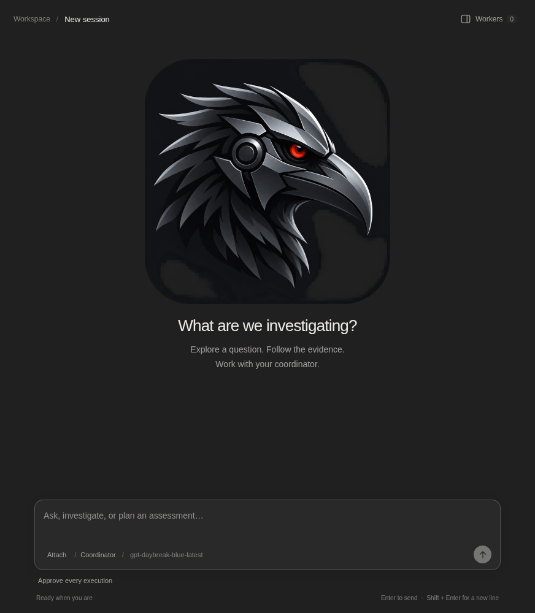
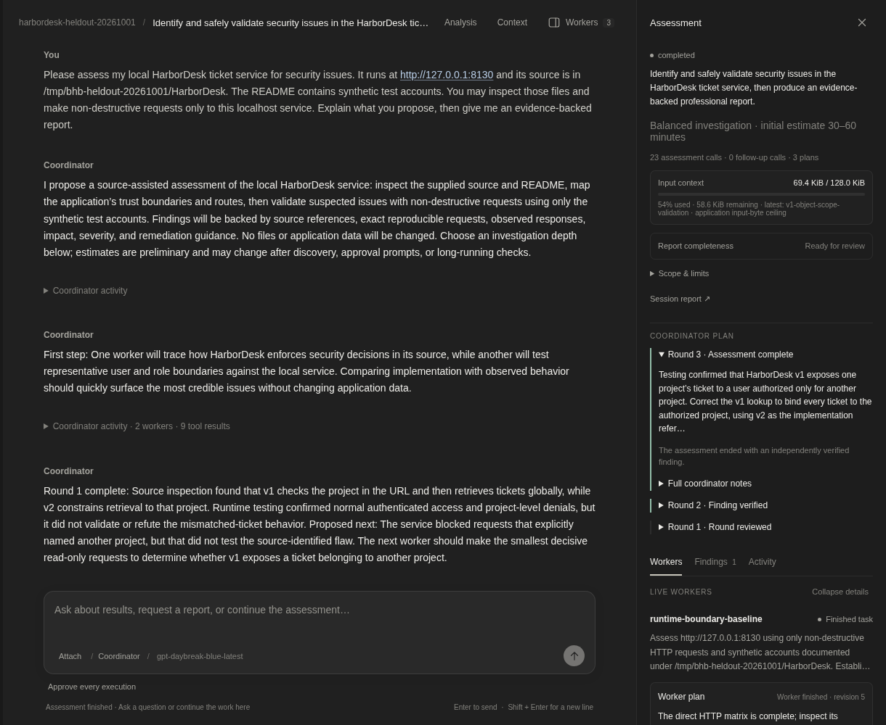
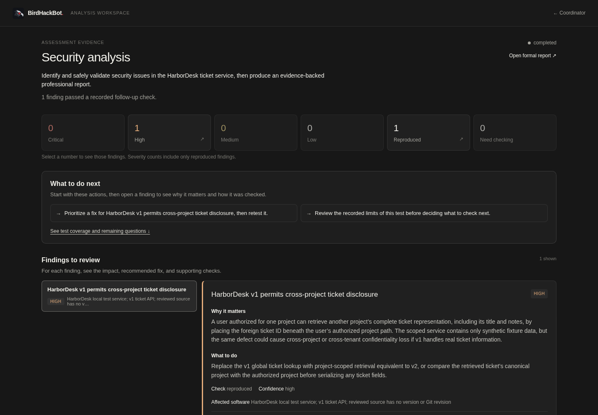

# BirdHackBot

<p align="center">
  
</p>

BirdHackBot is a penetration-testing tool built for Kali Linux. Tell the coordinator what you want to investigate. It suggests a sensible route, sends independent tasks to workers in parallel, and changes the plan when new evidence calls for it. You can ask questions, choose which tests to run, and follow the work as it happens.

The operator sets the target boundaries and is responsible for authorization. BirdHackBot records those boundaries and offers three execution-approval levels: review every action, review commands and risky actions, or approve everything within the session. You can stop all workers at any time.

## See it in action

These screenshots come from the current local web app. The new-session view shows the detailed raven; the smaller [bird-head icon](internal/webapp/static/logo-small.svg) stays in the navigation and favicon.



The coordinator conversation stays in the center, with plans and worker progress alongside it. This example uses a synthetic local test service.



The Analysis view shows what was tested, where weaknesses were found, what still needs checking, and what to fix first. A customer folder can bring results from several sessions together.



## What you can do

- **Investigate interactively.** Ask about a system, explore an idea, or request a full assessment. The coordinator explains useful next tests and lets you choose before workers run them.
- **Run independent work in parallel.** The coordinator can send separate tasks to two workers at once. It brings their results together, changes the plan when a test fails or reveals something new, and asks another worker to verify important findings.
- **Find the right knowledge for the job.** The coordinator can research a product, look up relevant vulnerabilities, and suggest practical guides for each task. A worker loads the guidance it needs as the investigation develops. Guides inform the test; observations from the target decide the result.
- **Use Kali's tools and source code.** Workers can run approved commands, inspect available source, and write a small helper when standard tools are insufficient. They check which tools and data are actually installed before relying on them.
- **Examine web applications.** A delegated Playwright worker can follow pages and user flows, capture screenshots and traces, and expose an optional live browser preview beside the chat.
- **See what happened.** Each test saves the command, result, timing, and supporting files. The interface separates possible weaknesses from findings that another worker has checked against the target.
- **Explore the results.** Analysis compares sessions in the same customer folder. It links findings to evidence, shows tested areas and gaps, and puts suggested fixes beside each risk.
- **Create formal reports.** Ask for an OWASP WSTG- or PTES-aligned report in Markdown or PDF. Templates check that scope, test results, evidence, limitations, and review details are present. The report is saved with the session and linked directly in chat.
- **Continue long investigations.** The coordinator and each worker keep track of their own work. Older details can be saved and brought back when needed. A local debug view shows exactly what information each model received.

The web app and terminal UI share the same coordinator, workers, approvals, and saved evidence. The browser is the main place to explore a session; the CLI opens with a compact ASCII version of the raven for terminal use.

## Start on Kali Linux

Install the baseline packages in the [Kali installation guide](docs/runbooks/kali-installation.md), then build from the repository checkout:

```sh
go build -buildvcs=false -o birdhackbot-web ./cmd/birdhackbot-web
go build -buildvcs=false -o birdhackbot ./cmd/birdhackbot
```

Start the browser app and open the URL it prints:

```sh
./birdhackbot-web
```

It listens on `127.0.0.1:8080` by default. Run one web server at a time; stop the existing process before starting a replacement. The server is intended for local use and has no authentication or remote-deployment controls yet.

For the terminal UI, run:

```sh
./birdhackbot
```

The first conversation can be exploratory. When you want workers to act, review the proposed target, tasks, and approval level. The terminal supports saved sessions, model settings, worker status, and stopping active work. See the [web application guide](docs/runbooks/web-application.md) and [tool capability guide](docs/runbooks/tool-capabilities.md) for the full workflows.

## Choose a model

The web Settings panel can start a ChatGPT subscription sign-in. A local bridge connects BirdHackBot to the model; BirdHackBot still runs the tools and saves the evidence. This uses your Codex sign-in rather than an API key. The connection depends on your account access and may need updates if the provider changes its service. See the [subscription setup guide](docs/runbooks/subscription-bridge.md).

For local models, configure an OpenAI-compatible endpoint. To switch between saved model profiles from the web UI, copy [the profile example](config/model-profiles.example.json) to `config/model-profiles.local.json` and set the endpoint and model ID there. Click the model name below the composer to choose a profile. Starting a new model opens a new session so the histories remain separate. The saved Qwen 3.8 profile requests low reasoning; the Daybreak profile requests high. The model server's actual context and concurrency settings remain its own configuration.

For a fully air-gapped deployment, use a local model and block external network access in the deployment environment. Setting `BIRDHACKBOT_RESEARCH_MODE=air_gapped` disables the app's external observation tools and tells the coordinator and workers to use local sources; that setting alone cannot block network traffic.

## Work with sessions and results

A new session starts as a conversation, without an assessment form. Describe what you know; the coordinator can suggest focused, balanced, or thorough work and rough time ranges. You choose which proposed tasks to run and may ask for a different plan. During execution, the chat shows approvals and short progress updates. Expand activity for commands and evidence, or open a worker in the right panel for its current task and browser preview. You can continue talking to the coordinator while workers run.

Create customer folders from the left sidebar and drag sessions into them. You can reopen or delete sessions there. A completed assessment stays conversational: ask follow-up questions, request another in-scope round, or export a report without losing its earlier evidence. Reports and raw logs remain in that session's local folder.

Analysis is separate from the chat. Open it from a session or customer folder to compare risks across assessments, inspect the pages workers visited, view screenshots, and see which areas still need testing. Open a finding to see why it matters, how it was checked, its supporting evidence, and the proposed fix. A software or CVE match is a lead to investigate, not proof that a target is vulnerable. Reports remain drafts for professional review; if a required detail is missing, the report shows the gap instead of inventing an answer.

## Where the project stands

The coordinator and worker workflow, model connection, browser and terminal interfaces, saved sessions, long-session memory, evidence capture, Analysis, and report export are implemented. We have exercised them in local lab assessments. We still need broader tests on unfamiliar systems, stronger checks that available source matches the running software, and full validation of air-gapped operation. Those goals are tracked in [TASKS.md](TASKS.md) and the [acceptance gates](docs/runbooks/acceptance-gates.md).

The current web server is loopback-only. It does not provide its own target network sandbox or enforce a target allowlist. The operator's selected scope and approvals govern execution; protect the Kali environment accordingly. The [operating rules](AGENTS.md) explain authorization, evidence handling, and safety boundaries.

## Development and documentation

```sh
./scripts/ci.sh
go test -race ./...
```

Keep changes tied to a demonstrated problem or agreed capability, and validate both the underlying logic and the operator path through the app.

| Document | Purpose |
| --- | --- |
| [PROJECT.md](PROJECT.md) | Repository structure, conventions, and build commands |
| [Architecture](docs/architecture.md) | Coordinator, worker, context, and evidence design |
| [TASKS.md](TASKS.md) | Current work and validation status |
| [ROADMAP.md](ROADMAP.md) | Longer-term product goals |
| [DISCOVERIES.md](DISCOVERIES.md) | Decisions and findings from development |
| [Kali installation](docs/runbooks/kali-installation.md) | Required platform packages and optional tools |
| [Subscription setup](docs/runbooks/subscription-bridge.md) | ChatGPT sign-in and local bridge |
| [Web application](docs/runbooks/web-application.md) | Session workflow and browser features |
| [Acceptance gates](docs/runbooks/acceptance-gates.md) | What testing has and has not established |

Earlier plans live under `docs/archive/`; old code is under `legacy/`. Neither defines the current implementation.
